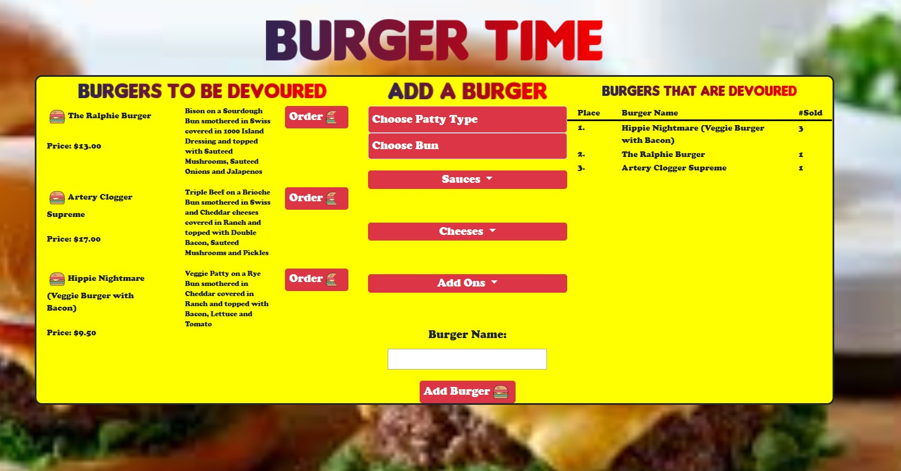

### with Sequelize

### Overview

Burger time is an application deployed to Heroku that allows users to view, create and order hambugers they would like to eat.  The application uses a JAWSDB database and Sequelize to query the database.  

### Application Use

When the page loads the user can either order a hamburger that was already created or create a burger.  If the user chooses to create a burger they get to choose the type of patty, such as beef, veggie, or bison, the type of bun, there are 4 kinds, any sauces or cheeses they would like to add, as well additional toppings like sauteed onions or bacon.  The components are listed with an "add on" price that indicated the price to add the component to the burger.  Some components are free to add on, some cost more.  Some of the burger patties, such as bison come with an upcharge.  The user then names the burger, whatever they wish and the burger is added to the left side with an order button for future users to order it.

When the burger is added, a description of the burger is added with all the components. The price is then added based on a $7.50 base price and all the premium additions that were added on.  The burger is then added to the right of the bestsellers list with a total of one. (It is assumed that the user wished to eat the burger they created).

A user is also free to choose to order a burger made by a previous user.  In that case, the number sold of that particular burger is incremented up by one and the burger rises on the best sellers list.  

See who can create the most popular burger!!!

Disclaimer: Users do not actually receive burgers.

### [Link to app page](https://pacific-ravine-02793.herokuapp.com/)        
